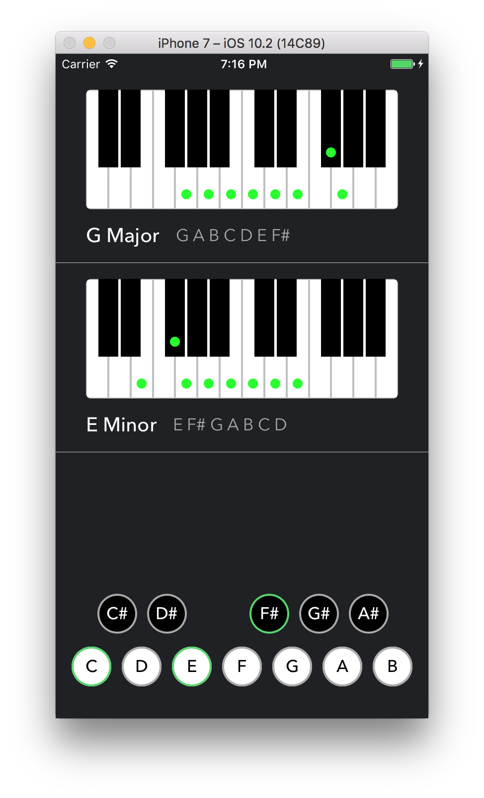

# KeyJam
An iPhone application for music makers lacking perfect music theory.

Currently I do no have plans to put the application onto the App Store. The only way to install the app is with some knowledge of Xcode.

## Dependencies

- Easy Animation
- SnapKit

## Instructions

1) Download or clone the project
2) Open Xcode and make sure you are logged into your dev account. If you do not have a dev account go to Preferences > Accounts and sign in with your Apple ID
3) Open the KeyJam.xcworkspace file
3) Build and install on your iOS device!

## Credit

[App Icon](https://thenounproject.com/search/?q=music&i=684877) created by AlePio from the Noun Project