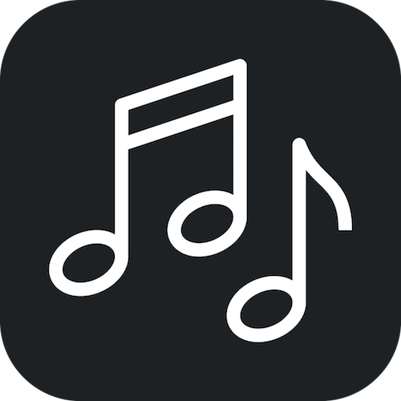

# KeyJam

An iPhone application for music makers lacking perfect music theory.

### Concept 🎹

I made this app to help me along with making music. I will be playing with my synthesizer, making a bassline with a few notes, and I want to take this idea from a riff into a full song. I don't have formal music training, so I can't always remember the rest of the notes in the key that I am playing. With the help of KeyJam, I can tap in the notes I am playing and quickly see which keys the notes I am playing are in.

Currently, I don't have plans to put the app in the App Store.

### Instructions 📝

1. Download or clone the project
2. Open Xcode and make sure you are logged into your dev account. If you do not have a dev account go to `Preferences > Accounts` and sign in with your Apple ID
3. Open the KeyJam.xcworkspace file
3. Build and install on your iOS device!

### Dependencies ✅

- Easy Animation
- SnapKit

### Credit 🏆

[App Icon](https://thenounproject.com/search/?q=music&i=684877) created by AlePio from the Noun Project